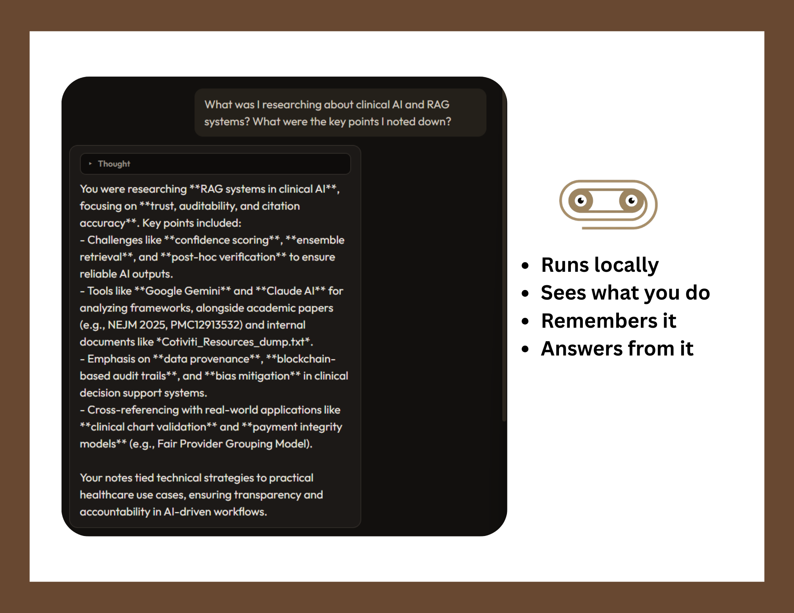
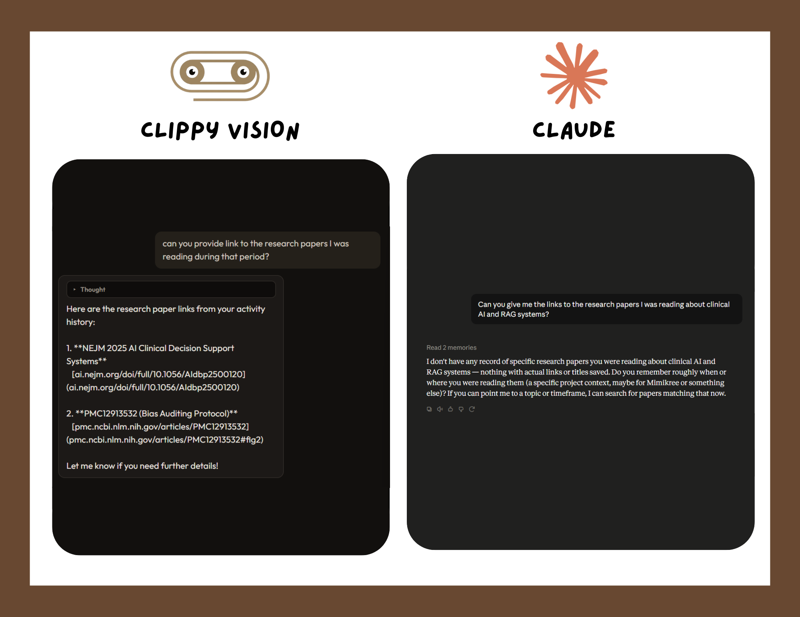

# Clippy Vision

> **A fully local AI assistant that watches your work to eliminate the context problem. 100% private — no cloud, no data leakage.**


[](#contributors)
[](https://www.codetriage.com/protocorn/clippy-vision)

<p align="center">
  
</p>

---

## What is Clippy Vision?

Clippy Vision is a desktop AI companion that passively observes your work — active windows, clipboard, typing patterns, and screenshots — and builds a continuously updating memory of everything you do. When you open the chat, it already knows your context. No copy-pasting. No re-explaining.

Everything runs entirely on your machine. No API keys, no cloud, no data leaving your device.

---

## How Clippy Vision fits with Claude / ChatGPT

Claude and ChatGPT are built for **reasoning, writing, and general knowledge**. They're excellent when you bring them context — a pasted error log, a document, a research question. They are not built to know what was on your screen yesterday, which paper you opened last Tuesday, or what bug you fixed two weeks ago without you telling them.

Clippy Vision is built for the **context problem**. It passively watches your work, remembers it, and answers from that memory. It doesn't replace Claude or ChatGPT — it fills the gap they can't: your personal activity history.

| | Claude / ChatGPT | Clippy Vision |
|--|--|--|
| Strength | Reasoning, writing, coding help, world knowledge | Personal memory of *your* work |
| Needs you to paste context | Yes | No — already saw it |
| Runs where | Cloud | 100% on your machine |
| Best for | "Help me solve / write / explain this" | "What was I doing / reading / debugging?" |

Use Clippy Vision when you need your own history back. Use Claude or ChatGPT when you need a powerful reasoning partner. Many people use both — Clippy to reconstruct context, then paste that into Claude to go deeper.

<p align="center">
  
</p>

<p align="center"><em>Runs locally · Sees what you do · Remembers it · Answers from it</em></p>

<p align="center">
  
</p>

<p align="center"><em>Same question asked to both. Clippy returns the exact paper URLs from browsing history. Claude has no record of them.</em></p>

---

## Download

**→ [Download Clippy Vision for Windows or macOS](https://github.com/rusetiq/clippy-vision/releases/latest)**

The installer includes a setup wizard that handles Python, Ollama, and all required models automatically. No terminal required.

### System requirements

Clippy Vision runs local AI models (text + vision) on your PC. Capture shares the GPU/RAM with Chrome, your IDE, and Windows — underpowered machines will feel lag when switching apps.

| | Minimum | Recommended |
|--|---------|-------------|
| OS | Windows 10 / 11 (64-bit) | Windows 11 |
| System RAM | 16 GB | 32 GB |
| GPU VRAM | 6 GB dedicated | 8 GB+ dedicated |
| Free disk | 12 GB | 15 GB+ |

- **First run** also needs internet once (model downloads, ~8 GB).
- The setup wizard **checks your PC** against these numbers before installing. Below minimum → setup is blocked. Between minimum and recommended → you can continue with a warning that capture may lag.
- Integrated / shared GPU (0 GB dedicated VRAM) is treated as below minimum for full capture.

---


## Quick Start

### Option A — Installer (recommended)

1. Download `ClippyVision-Windows-Setup-1.2.0.exe` on Windows, or the matching `ClippyVision-macOS-arm64-1.2.0.dmg` (Apple Silicon) / `ClippyVision-macOS-x64-1.2.0.dmg` (Intel) on macOS
2. Follow the setup wizard (installs Python, Ollama, and AI models)
3. Launch from Start Menu → Clippy Vision

### Option B — Run from source

```powershell
git clone https://github.com/protocorn/clippy-vision.git
cd clippy-vision\electron-ui
npm install
npm start
```

The app will open the setup wizard on first launch and walk you through dependencies.

---

## Features

- **Passive screen awareness** — captures foreground windows, clipboard, typing bursts, and screenshots in the background
- **Privacy-first redaction** — Clippy Vision's own window is blacked out in every screenshot before the AI ever sees it
- **Three-tier event classification** — rule-based → feature-based → LLM fallback, so only meaningful events are stored
- **Vision classification** — OCR and activity inference on screenshots using `qwen3-vl:4b`
- **Hierarchical memory** — events → session summaries → distilled long-term facts; memory never resets
- **Smart query router** — a fine-tuned MiniLM classifier routes every question to the right retrieval strategy before the LLM is even called
- **ReAct agent** — structured reasoning with tools: SQL generation, memory recall, fact saving
- **Conversation memory** — rolling summaries + semantic search over past conversations
- **Privacy controls** — toggle redaction per app (WhatsApp, Telegram, incognito windows, etc.)
- **Toggle capture** — start/stop data capture from the tray icon or the in-app button, with a desktop notification on change

---

## Tech Stack

| Layer | Technology |
|-------|-----------|
| Desktop UI | Electron |
| Backend | Python / FastAPI / Uvicorn |
| Local LLM runtime | [Ollama](https://ollama.com) |
| Main reasoning model | `qwen3:8b` |
| Vision / OCR model | `qwen3-vl:4b` |
| Embedding model | `nomic-embed-text` |
| Query classifier | Fine-tuned MiniLM-L3 |
| Database | SQLite (WAL mode) |
| Screen capture | `mss`, `pywin32`, `pynput` |

---

## Architecture

### Segment 1 — Data Capture

`core/screen_capture.py` runs as a background process and captures:

- Active foreground window (title, process name, active URL)
- Clipboard contents (copy and paste events)
- Context switches (window focus changes)
- Keystroke dynamics with per-app adaptive baseline
- Screenshots (taken proactively on activity bursts)

Every captured event passes through a three-tier classification pipeline before being stored:

**Tier 0 — Rule-based** (deterministic, instant)
Fast rules that immediately flag obvious signals: too few keystrokes → not interesting; known background system process → not interesting; typing deviation from personal baseline → interesting (score 9).

**Tier 1 — Feature-based** (scoring)
Scoring starts at 5. Multiple features add or subtract: typing deviation, context novelty (how many times this app was seen in 7 days), typing intensity z-score, clipboard content length. Events below 4 are dropped; above 7 are kept; 4–7 go to Tier 2.

**Tier 2 — LLM fallback**
The last 3 events + current event are sent to `qwen3:8b` for context-aware classification. Output: `INTERESTING`, `NOT_INTERESTING`, or `NEEDS_VISION`.

**Tier 2.5 — Vision classification**
Screenshots are pre-captured (3 exposures, exponentially delayed) on every activity burst. A background processor (`core/screenshot_processor.py`) groups visually identical screenshots using perceptual hashing (Union-Find, pHash bit distance ≤ 2), runs `qwen3-vl:4b` once per group, and propagates the verdict. Each screenshot is matched to the nearest database event (±10 s); if none exists, a `screenshot_analysis` event is created automatically.

---

### Segment 2 — Summarization

A background summarizer runs every 5 minutes and groups recent interesting events into session summaries using `qwen3:8b`. It runs in two passes per tick:

- **Pass 1:** Summarizes pending events immediately without waiting for vision
- **Pass 2:** Re-summarizes sessions where vision has since completed, overwriting with richer data

---

### Segment 3 — Distiller

Runs every 5 sessions and extracts high-level behavioral facts from summaries. Each fact is:
1. Vector-embedded
2. Compared against existing cluster centroids (threshold: 0.75 cosine similarity)
3. Routed to the closest cluster or a new one
4. Processed with a second LLM call: **ADD / UPDATE / NOOP / CONFLICT**

Conflicting facts are preserved in `memory_conflicts` and surfaced to the agent for user resolution. User-provided corrections via `save_identity` automatically close related conflicts.

---

### Segment 4 — Query Router

A fine-tuned **MiniLM-L3** classifier (`agent/router.py`) maps every incoming query to one of:

| Category | What it covers |
|----------|---------------|
| `time_anchored` | "What was I doing yesterday at 3 PM?" |
| `topic_search` | "What did I work on related to Clippy?" |
| `specific_recall` | "What URL was I reading this morning?" |
| `memory_query` | Questions about facts Clippy has memorized |
| `casual` | General chat, no retrieval needed |

Each category has a dedicated prefetch module. Context is retrieved in parallel before the LLM is called, so the agent already has relevant data in its prompt without needing to make tool calls reactively.

---

### Segment 5 — The Agent

A **ReAct agent** (`agent/react_agent.py`) with function calling. Tools available:

| Tool | Description |
|------|-------------|
| `search_sessions` | SQL queries against the sessions/summaries table |
| `search_events` | SQL queries against the raw events table |
| `recall_memory` | Lists all memory cluster labels |
| `fetch_cluster` | Fetches facts from a specific cluster |
| `save_identity` | Saves autobiographical details |
| `save_note` | Saves explicit things the user wants remembered |

Prompt components: conversation history (last 8 turns + rolling summaries), user profile, top-8 memory facts by semantic similarity, and prefetched context from the router.

---

### Segment 6 — Database

All data lives in a local SQLite database (`core/data/events.db`):

| Table | Contents | Retention |
|-------|----------|-----------|
| `events` | Raw captured events | 7 days |
| `sessions` | Summaries of events | 90 days |
| `memory_clusters` | Cluster metadata | Permanent |
| `memory_facts` | Individual long-term facts | Permanent |
| `memory_conflicts` | Unresolved fact contradictions | Permanent |
| `memory_meta` | Settings and distiller state | Permanent |
| `conversations` | Full conversation history | Permanent |
| `user_profile` | User name | Permanent |

FTS5 virtual tables on `events` and `sessions` enable full-text search across all stored content.

---

## Privacy

- All processing is local. Nothing leaves your machine.
- Clippy Vision's own window is blacked out in screenshots before any AI model sees them.
- You can toggle data capture on/off at any time from the tray icon.
- Per-app redaction: configure WhatsApp, Telegram, Signal, incognito browser windows, and others to be blacked out in screenshots.
- Captured data has TTLs: raw events expire after 7 days, session summaries after 90 days.

---

## Building from Source

```powershell
# Python dependencies
pip install -r requirements.txt

# Run the desktop app
cd electron-ui
npm install
npm start

# Build the Windows installer
npm run dist
```

The built installer appears at `electron-ui/dist/ClippyVision-Windows-Setup-{version}.exe` (or `ClippyVision-macOS-{arch}-{version}.dmg` when building on macOS).

---

## License

MIT — see [LICENSE](LICENSE) for details.

---

## Contributors

Clippy Vision exists because people showed up — with code, docs, bug reports, design taste, and wild ideas. **Your name belongs on this wall.** First PR? First issue? First typo fix? That counts.

[](#contributors)
[](https://github.com/protocorn/clippy-vision/graphs/contributors)

### Hall of fame

Profiles, contribution types, and lines of code — refreshed automatically by GitHub Actions whenever `main` moves.

<!-- CONTRIBUTORS-STATS:START -->

| | Contributor | Types | Commits | Lines added | Lines removed |
| :---: | :--- | :--- | ---: | ---: | ---: |
| <a href="https://github.com/protocorn"></a> | <a href="https://github.com/protocorn"><b>@protocorn</b></a> | 💻&nbsp;<sub>code</sub><br/>📖&nbsp;<sub>doc</sub><br/>🎨&nbsp;<sub>design</sub><br/>🤔&nbsp;<sub>ideas</sub><br/>🚧&nbsp;<sub>maintenance</sub> | 47 | +85,583 | −1,535 |
| <a href="https://github.com/cyforkk"></a> | <a href="https://github.com/cyforkk"><b>@cyforkk</b></a> | 💻&nbsp;<sub>code</sub> | 1 | +32 | −11 |

<sub>Stats are regenerated automatically from git history by <code>scripts/update_contributors.py</code>.</sub>
<!-- CONTRIBUTORS-STATS:END -->

### Contribution types we celebrate

We follow the [All Contributors](https://allcontributors.org/) spec — code is only one way to help.

| | Type | Examples |
| :---: | :--- | :--- |
| 💻 | `code` | Features, bugfixes, refactors |
| 📖 | `doc` | README, guides, comments that teach |
| 🐛 | `bug` | Repro steps, crash reports |
| 🤔 | `ideas` | Feature proposals, architecture feedback |
| 🎨 | `design` | UI polish, icons, UX |
| ⚠️ | `test` | Tests, QA passes |
| 👀 | `review` | Thoughtful PR reviews |
| 🚧 | `maintenance` | Deps, CI, repo hygiene |

**Want on this list?** Open a PR, fix a typo, file a good bug, or comment on an issue:

```text
@all-contributors please add @your-username for code, doc
```

Newcomers welcome — see [CONTRIBUTING.md](CONTRIBUTING.md) for setup and good first issues.

---

## Contributing

See [CONTRIBUTING.md](CONTRIBUTING.md).
